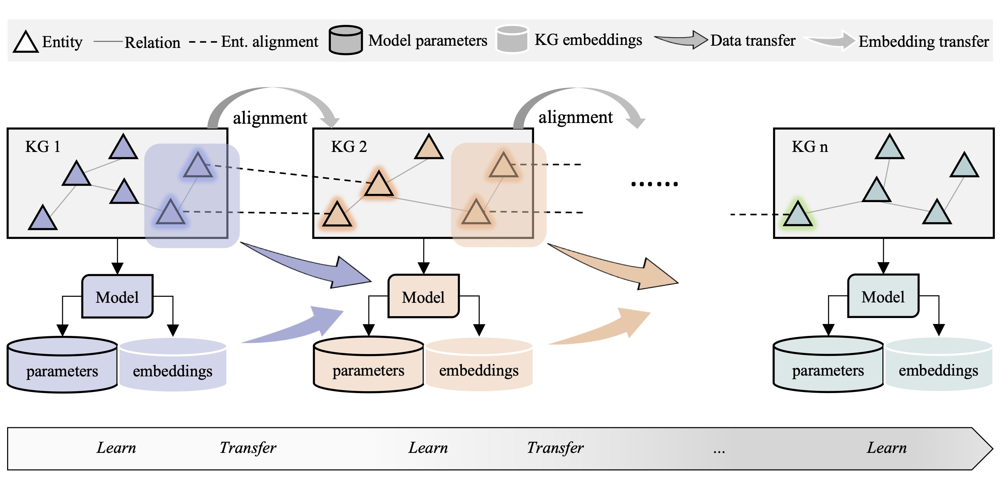
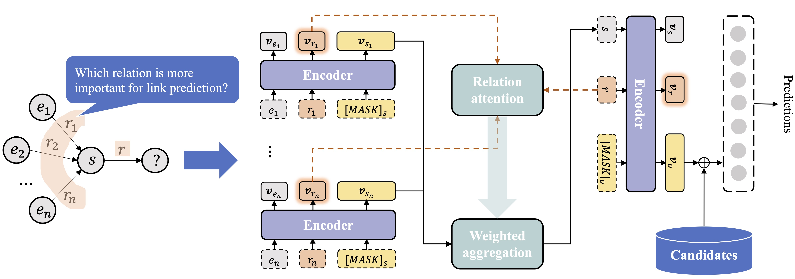

# 基于链接实体回放的多源知识图谱终身表示学习 
### Lifelong Representation Learning on Multi-sourced Knowledge Graphs via Linked Entity Replay

> 知识图谱存储大量的结构化知识和丰富的语义信息,已被广泛应用于知识驱动的智能软件.随着智能应用的不断发展,它们对知识图谱的需求也在发生变化.而单一知识图谱往往具有数据不完备等缺点,难以满足需求.因此,支持新数据来源、融合多源知识已经成为迫切需求.传统的知识图谱表示学习和应用范式只考虑单一图谱,忽视了不同图谱间的知识迁移.多源知识图谱联合训练虽然可以带来性能提升,但不支持新增知识图谱的拓展表示.鉴于此,提出了多源知识图谱终身表示学习的新范式.给定一个知识图谱序列,终身表示学习的目标是在学习新知识图谱的同时,从已学习的知识图谱与模型中获得知识迁移.为实现这一目标,提出了一个基于链接实体回放的多源知识图谱终身表示学习框架.首先,设计一个以Transformer为编码器的知识图谱表示学习模型作为框架核心,利用关系相关性进行实体的链接预测.其次,提出链接子图构造方法,基于实体对齐构建并回放新增知识图谱和已有知识图谱之间的链接子图进行终身学习和知识迁移.最后,采用动态结构方法,为每个知识图谱存储相应的模型参数快照来避免灾难性遗忘.多个链接预测基准数据集上的实验结果表明,所提出的表示学习模型可以取得最先进的性能,且提出的终身表示学习框架可以实现有效的知识迁移.

> Knowledge graphs store a great amount of structured knowledge and semantic information. They have been widely used by many knowledge-powered intelligent applications. With the rapid development of these applications, their requirements for knowledge also change. A single KG usually suffers from the incompleteness issue and therefore is unable to meet the requirement. This suggests an urgent demand for supporting new data sources and fusing multi-sourced knowledge. The conventional paradigm for knowledge graph representation learning and application only considers a single knowledge graph and ignores the knowledge transfer between different sources. Joint representation learning on multi-sourced knowledge graphs can bring performance improvement, but it cannot support the extended representation learning of new knowledge graphs. To resolve these issues, this paper presents a new paradigm, i.e., lifelong representation learning on multi-sourced knowledge graphs. Given a sequence of multi-sourced knowledge graphs, lifelong representation learning aims at benefiting from the previously-learned KG and embedding model when learning a new KG. To this end, the work proposes a lifelong learning framework based on linked entity replay. First, it designs a Transformer-based knowledge graph embedding model that leverages relation correlations for link prediction between entities. Second, it proposes a linked subgraph generation method. It leverages the entity alignment between different sources to build the subgraph and replays the linked entities to enable lifelong learning and knowledge transfer. Finally, it uses a dynamic model structure with model parameters and embeddings stored for each KG to avoid catastrophic forgetting. Experiments on benchmarks show that the proposed knowledge graph embedding model can achieve the state-of-the-art performance in link prediction, and the lifelong representation learning framework is effective and efficient in multi-sourced knowledge transfer compared with baselines.

## 背景

传统知识图谱表示学习与应用范式如图1(a)所示,随着任务不断到来,其根据不同任务需求选择不同知识图谱训练表示学习模型.在这一范式中,不同知识图谱的训练相互独立,没有利用知识图谱之间的互补性.近期的相关研究表明,通过实体对齐进行多源知识图谱联合训练,如图1(b)所示,可有效学到更具表达力的知识图谱向量表示,进而提高下游任务性能.但是联合训练不适用于任务不断更新和迭代的应用场景,会造成知识图谱的重复训练,导致资源浪费,且时间空间开销大.为了解决这些问题,本文提出多源知识图谱终身表示学习的范式.如图1(c)所示,随着任务不断迭代,不同的知识图谱也逐渐加入,终身表示学习(lifelong representation learning)的目标是在进行新知识图谱学习的同时,复用从先前知识图谱中学习到的语义信息,促进知识迁移,从而提高当前任务的效果.

<div align="center">
<p></p>
  
Fig. 1  Comparison of pipelines for multi-sourced KG representation learning and application paradigm

图1  多源知识图谱表示学习与应用范式对比

</div>

## 方法

多源知识图谱终身表示学习存在以下难点:其一,如何设计高效可迁移的知识图谱表示学习模型,这是终身表示学习模型高性能的基础;其二,如何将已学习的知识迁移到新增知识图谱的表示模型中,这是在持续新增知识图谱序列上实现终身表示学习的关键,现有的独立训练和联合训练方法都无法做到这一点;其三,如何在终身学习的同时防止参数覆盖,避免灾难性遗忘.针对上述三个挑战,本文提出了一种结合链接实体回放与动态结构的终身表示学习框架LifeKE.具体来说LifeKE主要包含三项技术:一个基于关系相关性聚合信息的Transformer编码器,一种基于链接子图筛选与回放的高效知识迁移方法,和一个基于动态结构的模型扩展方式.复杂度分析与实验结果表明,LifeKE不仅在单KG上具有较强的表示学习能力,而且在新增的知识图谱序列上能够高效复用已学习知识指导新模型学习,同时能够以很低的参数成本保留已学习的知识.

<div align="center">
<p></p>

Fig. 2  Framework overview of lifelong representation learning on multi-sourced KGs

图2  多源知识图谱终身表示学习框架

</div>

如图2所示,本文提出的多源知识图谱表示学习框架是一个逐步学习的过程.终身学习的过程中,框架为每一个知识图谱的实体和关系学习向量表示,且保存对应的表示学习模型.传统的单图谱依次训练和多图谱联合训练也需要保存每个图谱的实体和关系向量表示,因此所提出的框架几乎不会增加模型存储空间.给定相邻两个知识图谱的实体对齐数据,其中每一对实体均指向现实中的同一个实体,它们在知识图谱里的事实应具有相同的语义,它们的向量表示也应相同.这些对齐的实体是所提出的终身表示学习框架可以进行知识迁移的桥梁.框架包含两个技术模块.其一是基于关系相关性进行知识图谱表示学习的模型,利用实体已有关系和目标关系的相关性聚合实体信息,捕捉知识图谱中的关系语义(如图3所示).该模型是学习具有表现力的向量表示的关键,也是进行终身学习和知识迁移的基础.其二是知识图谱的终身表示学习方法.与传统终身学习持续学习不同,在本文的问题定义下,重点是学习新知识图谱的向量表示.考虑到多源知识图谱的异构性,旧表示学习模型的参数无法通过常用的局部更新等方式来进行持续学习.为此,本文方法基于数据迁移和参数迁移进行终身表示学习.

<div align="center">
<p></p>
Fig. 3  KG representation learning based on relation correlations

图3  基于关系相关性的知识图谱表示学习模型

</div>

## 代码

### 代码依赖

基于Python 3.6和TensorFlow 1.15实现本文提出的框架.代码依赖如下:

* Python 3.x (tested on Python 3.6)
* Tensorflow 1.x (tested on Tensorflow 1.14 and 1.15)
* Scipy
* Numpy
* Pandas
* Scikit-learn

### 运行

如想在FB15K-237上运行所提出的表示模型,请执行:

```bash
python lp_main.py --data_path ../dataset/fb15k-237/
```

lp_main.py里面提供了FB15K-237的默认参数.其他参数和运行脚本等请等待后续更新.如有问题,请联系zqsun.nju@gmail.com.
